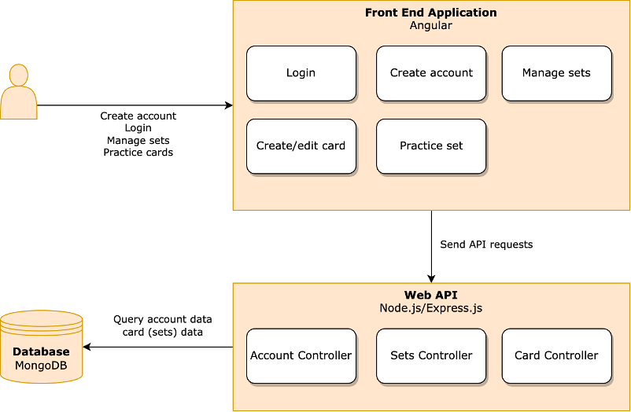
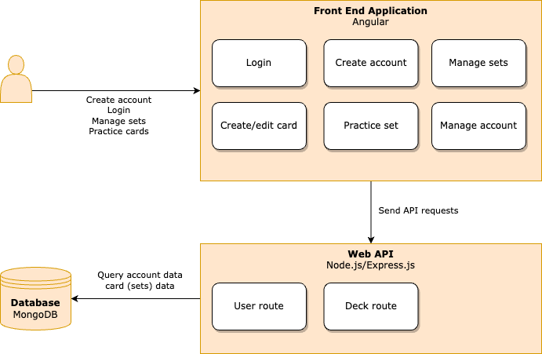

# Flash Cards
## Installation instructions

1. In the /server directory, create a file called .env and paste the provided database connection string in the file like so: `ATLAS_URI=xxxxxxxxxxxxxxxx`. 
    > For security reasons, the key is provided in the PowerPoint fil
2. Run `npm ci` in both the /client and the /server directory.
3. Run `npm start` simultaneously in /client and /server.
4. The application is now usable on http://localhost:4200/

> Everytime when the server is started, the script generateJwtSecret.js will run. 
> This script checks the .env file for the existence of a JWT secret key. If it does not exist, it will create one and place it in the file. 
> For running the application it doesn't really matter what that key is, but beware that as soon as it changes,
> all JWT tokens in use by any authenticated users will be invalid.

## Design

The original design was as follows:

During development a few design changed seemed to be appropriate. 
The front end has remained largely unchanged, except for adding a 'Manage account' component.

In the backend structure there are more changes.
These changes had to do with the structure of the database. While initially it seemed like a good idea to
structure the DB into separate collections of Users, Decks and Cards (like in a relational database, it turned out that 
in a Mongo DB it is preferred to store everything that belongs to a user under the user, leaving us with only one collection called User
Also, when using node.js and express the term 'Controller' is not very appropriate, and Routes is a better term. I did 
choose to keep working with two separate router (user and decks), but to remove the card routes, since all cards are
managed under the deck route.

The updated design looks like this:

## Test Data / Test Cases
I have made an account with an example card deck for showcase purposes. The account name and password are
also provided in the PowerPoint presentation.

You can test these functional flows:

Logged out:
- Log in with username and password
- Create a new account

Logged in:
- Close the browser and open it again, to see the persistent login state functionality
- Review a deck by clicking on the 'book' icon
- Edit a deck by clicking the 'pencil' icon
- Remove a deck by clicking the 'bin' icon
- Create a new deck
- Go to the account settings and edit username or password
- Log out
